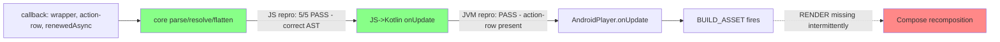

# Handover: intermittent action-row missing after async-node update

**Player Android/JVM 0.15.3** · GenUX Agent Chat Android · owner: Android adaptor · 2026-07-22

## Symptom

On stream complete, the `streaming-response-action-row` (copy/feedback) asset intermittently doesn't render on the latest bot message. Consumer calls the async-node callback with a flat list `[agent-response-wrapper, streaming-response-action-row, renewedAsyncNode]` (flatten collection). Store update + handler append + asset build all succeed; the composable never runs.

## Log signature (the key clue)

- Store updated ✓
- Handler append ✓ (`actionRowAppendedToPlayer=true`)
- `BUILD_ASSET` fires ✓
- `RENDER` never fires ✗ → **asset is built but never composed**

## What we ruled out: Player **core** is clean

Wrote a core repro against tag `0.15.3` (`plugins/async-node/core`) reproducing the exact update shapes. **5/5 pass** — core's parse → resolve → flatten never drops the action-row:

| Suite | Shape covered | Result |
|---|---|---|
| flatten chained ×6 | renewed flatten async + action-row per update | ✓ |
| transform-based ×5 | real `agent-chat-container` (chat-message→collection transform) | ✓ |
| two-async/turn ×4 | `streaming-processor` node + FRF content node resolving in quick succession | ✓ |

Every action-row survives every update; counts match exactly. So the AST handed to Android is correct.

## What we ALSO ruled out: the JS→Kotlin `onUpdate` data is correct

Wrote a JVM (platform-layer) test exercising the exact `view.hooks.onUpdate` boundary `AndroidPlayer` wraps. Across 6 chained streaming updates delivering `[wrapper, action-row, renewedAsync]`, **every action-row is present in the `onUpdate` payload** (counts exact). Ran on J2V8 — **PASS**.

`AndroidPlayer.onUpdate` feeds this same payload into `expandAsset`/Compose, so the data reaching the Android decode/render layer is correct. **This is not a data bug.**

- Test: `plugins/async-node/jvm/src/test/kotlin/.../asyncnode/StreamingActionRowTest.kt`
- Run: `bazel test //plugins/async-node/jvm:async-node-test`

## Conclusion

Core AST is correct (JS repro) **and** the data crossing into Kotlin `onUpdate` is correct (JVM repro). `BUILD_ASSET` fires but `RENDER` doesn't. Therefore the drop is **in the Android adaptor's decode (`expandAsset`) + Compose recomposition path** — not core, not the data.

## Tier B — Android render layer (Robolectric): partial, harness-limited

Added a Robolectric render test driving the real `AndroidPlayer.onUpdate → expandAsset → render` pipeline (`StreamingActionRowRenderTest.kt`, modeled on `ChatMessageAssetTest`/`AssetTest`). Status:

- ✅ Toolchain fully working in-env (see "Environment setup" below). Baseline `ChatMessageAssetTest` **PASSES** headless.
- ✅ My test **decodes correctly** — the chat-message→collection transform + async node resolve into the `RenderableAsset` tree with the Android renderers registered (an early bug where the collection was "not registered" was a wrong import: must use the **Android** `com.intuit.playerui.android.reference.assets.ReferenceAssetsPlugin`, not the core/JVM one).
- ⚠️ **Open item:** driving an async *streaming* update and asserting the appended action-row **renders** times out under Robolectric (`awaitRendered` → "Expected view to update, but it did not"). Two reasons:
  1. **No precedent** — there is *no existing Android test in the repo that resolves an async node*. The async-streaming drive pattern (capture the `onAsyncNode` continuation, resume it, await the re-render) is unestablished here. This absence is itself telling: the Android async-streaming render path is untested.
  2. **Robolectric limitation** — Robolectric does not run real Compose recomposition frames, so `awaitCompleteHydration()` (waits on `R.bool.view_hydrated`) can hang for async/`SuspendableAsset` content. The render assertion is exactly the Compose-recomposition step Robolectric can't faithfully simulate.

**Recommendation:** move the Tier B *render* proof to an **on-device/emulator Compose-UI test** (assert `testTag("action")` node count after each streamed update) rather than Robolectric. The decode half (action-row present in the `RenderableAsset` tree) can stay Robolectric. This cleanly splits: decode (Robolectric, cheap) vs. recomposition (Compose-UI/emulator, where the bug actually is).

**Compose-UI test + enabling pieces (committed, UNVALIDATED — needs Android NDK to compile + emulator to run):**
- Test: `android/demo/src/androidTest/.../streaming/StreamingActionRowComposeUITest.kt` — asserts all streamed action-rows render (`waitUntilNodeCount(hasTestTag("action"), N)`).
- `DemoPlayerViewModel` now includes an `AsyncNodePlugin` that **auto-streams** N `[wrapper, action-row, renewedAsync]` chunks for any live async node (so the test needs no continuation control).
- Mock: `android/demo/src/main/assets/mocks/streaming/streaming-action-rows.json` (flatten collection + one live async node).
- `android/demo` `main_deps` += `//plugins/async-node/jvm`.
- Run: `bazel test //android/demo:android_instrumentation_test` (with `ANDROID_HOME`, `ANDROID_NDK_HOME`, `JAVA_TOOL_OPTIONS` truststore, and a booted emulator).

- Scaffold + notes: `plugins/reference-assets/android/src/androidTest/kotlin/.../streaming/StreamingActionRowRenderTest.kt`
- Run: `bazel test //plugins/reference-assets/android:reference-assets-android-StreamingActionRowRenderTest-instrumented-test`

## Environment setup (to reproduce the Bazel/Android runs)

The 0.15.3 worktree needed all of the following (corporate proxy + fresh SDK):

1. Copy the git-ignored `.bazelrc.local` from the main checkout (trusts the Zscaler CA for the bazel *server* JVM).
2. Export `JAVA_TOOL_OPTIONS=-Djavax.net.ssl.trustStore=/Users/<you>/bazel-zscaler-truststore.jks -Djavax.net.ssl.trustStorePassword=changeit` so *spawned* resolver JVMs (android build-tools maven fetch) also trust the CA.
3. Export `ANDROID_HOME`/`ANDROID_SDK_ROOT` to the SDK.
4. The SDK only had `platforms/android-36.1`; rules_android only accepts integer API dirs (`android-<N>`, `level.isdigit()`), so symlink `android-36 → android-36.1` under `$ANDROID_HOME/platforms`. (Cleaner: install a stable integer platform, e.g. `android-35`, via the SDK Manager.)

### JVM Tier A sandbox note
Before the SDK was installed, the JVM test was run without an SDK by pointing the `async-node/jvm` test at the host-only `//jvm/j2v8:j2v8-macos` runtime (the default `//jvm/testutils:with-runtimes` pulls hermes + `j2v8-all`'s android AAR → needs `aapt2`). The committed BUILD keeps the normal `with-runtimes`.

## For Android team to investigate

1. **`AndroidPlayer.onUpdate`** — cache clear on every view update; confirm a newly appended flattened sibling isn't dropped from the rebuilt asset map.
2. **Compose recomposition / list diffing** of flattened collection children — does an appended sibling with a stable parent collection id get keyed/recomposed? Suspect stale keys or `remember` retaining the prior child list.
3. **Timing** — two async resolutions land close together (processor + content). Check for a race where the second update overwrites/skips the first's newly-built child.

## Why the workaround works (corroborates the above)

`replaceMessageContent(full content)` at `agentCompleteHandle` fixes it because a full replace forces a rebuild that the incremental Compose append sometimes skips. Reasonable to keep as mitigation while the adaptor is investigated.

## Repro

- Worktree pinned to tag: `../player-0.15.3` (`git describe` → `0.15.3`)
- Test: `plugins/async-node/core/src/__tests__/streaming-action-row.test.ts`
- Run: `node_modules/.bin/vitest run plugins/async-node/core/src/__tests__/streaming-action-row.test.ts`
- These are the JS/core-side proofs; the missing piece is an **Android-layer** test (AndroidPlayer.onUpdate + Compose) reproducing the append.

## Out of scope (separate issue)

`SKIP agentCompleteHandle no streamingMessageId` — stream lifecycle (completed with only a processor node, no FRF chunk). Different failure mode.
