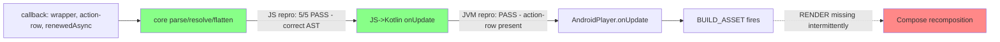

# Handover: intermittent action-row missing after async-node update

**Player Android/JVM 0.15.3** · GenUX Agent Chat Android · owner: Android adaptor · 2026-07-22

## Symptom

On stream complete, the `streaming-response-action-row` (copy/feedback) asset intermittently doesn't render on the latest bot message. Consumer calls the async-node callback with a flat list `[agent-response-wrapper, streaming-response-action-row, renewedAsyncNode]` (flatten collection). Store update + handler append + asset build all succeed; the composable never runs.

## Log signature (the key clue)

- Store updated ✓
- Handler append ✓ (`actionRowAppendedToPlayer=true`)
- `BUILD_ASSET` fires ✓
- `RENDER` never fires ✗ → **asset is built but never composed**

## What we ruled out: Player **core** is clean

Wrote a core repro against tag `0.15.3` (`plugins/async-node/core`) reproducing the exact update shapes. **5/5 pass** — core's parse → resolve → flatten never drops the action-row:

| Suite | Shape covered | Result |
|---|---|---|
| flatten chained ×6 | renewed flatten async + action-row per update | ✓ |
| transform-based ×5 | real `agent-chat-container` (chat-message→collection transform) | ✓ |
| two-async/turn ×4 | `streaming-processor` node + FRF content node resolving in quick succession | ✓ |

Every action-row survives every update; counts match exactly. So the AST handed to Android is correct.

## What we ALSO ruled out: the JS→Kotlin `onUpdate` data is correct

Wrote a JVM (platform-layer) test exercising the exact `view.hooks.onUpdate` boundary `AndroidPlayer` wraps. Across 6 chained streaming updates delivering `[wrapper, action-row, renewedAsync]`, **every action-row is present in the `onUpdate` payload** (counts exact). Ran on J2V8 — **PASS**.

`AndroidPlayer.onUpdate` feeds this same payload into `expandAsset`/Compose, so the data reaching the Android decode/render layer is correct. **This is not a data bug.**

- Test: `plugins/async-node/jvm/src/test/kotlin/.../asyncnode/StreamingActionRowTest.kt`
- Run: `bazel test //plugins/async-node/jvm:async-node-test`

## Conclusion

Core AST is correct (JS repro) **and** the data crossing into Kotlin `onUpdate` is correct (JVM repro). `BUILD_ASSET` fires but `RENDER` doesn't. Therefore the drop is **in the Android adaptor's decode (`expandAsset`) + Compose recomposition path** — not core, not the data.

## Next step to localize within Android — Tier B (for the Android team)

A Robolectric-headless render test that drives the real `AndroidPlayer.onUpdate → expandAsset → render` pipeline and asserts the action-row (a) decodes into the `RenderableAsset` tree and (b) hydrates to a rendered `View` (the missing `RENDER`). Scaffolded but **not yet runnable** — needs an Android SDK + Robolectric, and `//plugins/async-node/jvm` added to `reference-assets-android` `instrumented_test_deps`.

- Scaffold: `plugins/reference-assets/android/src/androidTest/kotlin/.../streaming/StreamingActionRowRenderTest.kt`
- Run (once wired): `bazel test //plugins/reference-assets/android:reference-assets-android-instrumented-test`
- If it reproduces (asset in tree, View never hydrates) → Compose recomposition of appended flattened siblings. If it passes → the bug is in the real app host's Compose layer, not the reference renderer.

### Sandbox repro note
The JVM test was run in an env without an Android SDK by temporarily pointing the `async-node/jvm` test at the host-only `//jvm/j2v8:j2v8-macos` runtime (the default `//jvm/testutils:with-runtimes` pulls hermes + `j2v8-all`'s android AAR → needs `aapt2`). The committed BUILD keeps the normal `with-runtimes`; use the j2v8-macos swap only when reproducing without an SDK.

## For Android team to investigate

1. **`AndroidPlayer.onUpdate`** — cache clear on every view update; confirm a newly appended flattened sibling isn't dropped from the rebuilt asset map.
2. **Compose recomposition / list diffing** of flattened collection children — does an appended sibling with a stable parent collection id get keyed/recomposed? Suspect stale keys or `remember` retaining the prior child list.
3. **Timing** — two async resolutions land close together (processor + content). Check for a race where the second update overwrites/skips the first's newly-built child.

## Why the workaround works (corroborates the above)

`replaceMessageContent(full content)` at `agentCompleteHandle` fixes it because a full replace forces a rebuild that the incremental Compose append sometimes skips. Reasonable to keep as mitigation while the adaptor is investigated.

## Repro

- Worktree pinned to tag: `../player-0.15.3` (`git describe` → `0.15.3`)
- Test: `plugins/async-node/core/src/__tests__/streaming-action-row.test.ts`
- Run: `node_modules/.bin/vitest run plugins/async-node/core/src/__tests__/streaming-action-row.test.ts`
- These are the JS/core-side proofs; the missing piece is an **Android-layer** test (AndroidPlayer.onUpdate + Compose) reproducing the append.

## Out of scope (separate issue)

`SKIP agentCompleteHandle no streamingMessageId` — stream lifecycle (completed with only a processor node, no FRF chunk). Different failure mode.
