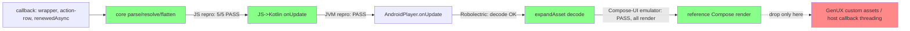

# Handover: intermittent action-row missing after async-node update

**Player Android/JVM 0.15.3** · GenUX Agent Chat Android · updated 2026-07-24

## TL;DR — who fixes this

| Layer | Owner | Verdict |
|---|---|---|
| Player core (JS + JVM) | Player core | ✅ ruled out — proven clean |
| Reference Android render | Player Android | ✅ ruled out — renders fine on device |
| GenUX render (`GenUXChatBodyAsset` / `AgentChatManagedPlayer`) | GenUX app | ✅ ruled out — filter/dedup/keys clean; last-state-wins render |
| **Async-node update ordering: `Bail(fullAsset)` clobbering the action-row `callback`** | **GenUX Agent Chat Android app** | ⬅️ **root cause / primary fix owner** |
| Async-update main-thread marshaling + test gap | Player Android adaptor | secondary hardening (not the root cause) |
| iOS | — | not involved (Android/JVM issue) |

**Route the fix to the GenUX Agent Chat Android app team** (async-node usage — see Root cause below); cc the Player Android adaptor team on the robustness suggestion.

## Root cause (final)

The missing action-row is an **async-node update ordering** problem in GenUX's content/handler code — **not** Player core, not the reference renderer, and not GenUX's rendering.

**How it was narrowed (each ruled out with evidence):**
- **Core** (JS + JVM): resolve/flatten + the `onUpdate` data are correct — repro tests pass.
- **Reference Android render**: on-device Compose test renders all streamed action-rows.
- **GenUX render**: `GenUXChatBodyAsset` keeps the action row (`streaming-response-action-row` is not in `conditionalAssetTypes`, so the `lastMessageId` filter doesn't drop it; `distinctBy`/`LazyColumn` key on a unique `id::type`). `AgentChatManagedPlayer` renders whatever `state.asset` currently is (last-state-wins). So *if the action row is in the resolved tree, it renders* — meaning when it's missing, it was already absent from the tree core emitted.
- **Threading**: GenUX's `Bail`/callback run on `viewModelScope` (main); Compose recomposes on main. Not the gap.

**The mechanism:** GenUX resolves a new message with `BailResult.Bail(messageResult.fullAsset)` and appends the action row later via the update `callback` — both write the **same node**, and core is **last-writer-wins per node** ([index.ts:293 callback vs 299 return](plugins/async-node/core/src/index.ts)). Their trace shows `Bail` is *called* ~120 ms before the callback (the safe order), but the `Bail` payload is the **whole message** — for a **long** response it's large, so marshaling it JVM→JS takes longer than that ~120 ms, and its *effect* lands **after** the small callback's. The stale `fullAsset` (no action row) becomes the last write → the emitted tree has no action row → GenUX's UI faithfully renders it → row dropped. Short responses marshal fast → `Bail` lands first → callback wins → row shows. **That is exactly why it's only long single-update responses.**

Reproduced deterministically on the real runtime (Hermes + J2V8) by `AsyncNodeOrderingTest`: a `Bail` applied *after* the callback drops the action row; applied *before*, it's kept.

**Fix (GenUX, content/handler side) — don't let the stale `Bail(fullAsset)` re-apply after the callback:**
1. **Resolve once with authoritative content** — if the stream is already complete at resolve time, include the action row in `fullAsset` so there's no separate late write to race; or
2. **Single path / buffer + serialize** — route a message's content through one mechanism (the callback), and don't apply a `Bail` snapshot once the callback has delivered newer content for that node, so the latest write always wins regardless of marshal latency.

`AsyncNodeOrderingTest` encodes the fatal vs. safe orderings directly, so it doubles as the acceptance check for the fix.

## Symptom

On stream complete, the `streaming-response-action-row` (copy/feedback) asset intermittently doesn't render on the latest bot message. Consumer calls the async-node callback with a flat list `[agent-response-wrapper, streaming-response-action-row, renewedAsyncNode]` (flatten collection). Store update + handler append + asset build all succeed; the composable never runs.

## Log signature (the key clue)

- Store updated ✓
- Handler append ✓ (`actionRowAppendedToPlayer=true`)
- `BUILD_ASSET` fires ✓
- `RENDER` never fires ✗ → **asset is built but never composed**

## What we ruled out: Player **core** is clean

Wrote a core repro against tag `0.15.3` (`plugins/async-node/core`) reproducing the exact update shapes. **5/5 pass** — core's parse → resolve → flatten never drops the action-row:

| Suite | Shape covered | Result |
|---|---|---|
| flatten chained ×6 | renewed flatten async + action-row per update | ✓ |
| transform-based ×5 | real `agent-chat-container` (chat-message→collection transform) | ✓ |
| two-async/turn ×4 | `streaming-processor` node + FRF content node resolving in quick succession | ✓ |

Every action-row survives every update; counts match exactly. So the AST handed to Android is correct.

## What we ALSO ruled out: the JS→Kotlin `onUpdate` data is correct

Wrote a JVM (platform-layer) test exercising the exact `view.hooks.onUpdate` boundary `AndroidPlayer` wraps. Across 6 chained streaming updates delivering `[wrapper, action-row, renewedAsync]`, **every action-row is present in the `onUpdate` payload** (counts exact). Ran on J2V8 — **PASS**.

`AndroidPlayer.onUpdate` feeds this same payload into `expandAsset`/Compose, so the data reaching the Android decode/render layer is correct. **This is not a data bug.**

- Test: `plugins/async-node/jvm/src/test/kotlin/.../asyncnode/StreamingActionRowTest.kt`
- Run: `bazel test //plugins/async-node/jvm:async-node-test`

## Conclusion (all four tiers now run)

Every layer exercised with the **reference** assets is clean: core AST (JS), the JS→Kotlin `onUpdate` data (JVM), decode (Robolectric), **and on-device Compose render (emulator)** — all streamed action-rows render. So the missing action-row is **NOT in Player core or the reference Android renderer**. It lives in the **GenUX-specific layer**: most likely (a) the custom `agent-response-wrapper` / `streaming-response-action-row` asset recomposition, or (b) the host's async stream-complete **callback threading**.

**Threading finding:** an iteration that resolved the stream on a *background* dispatcher threw `CalledFromWrongThreadException` (view touched off-main); only main-thread-marshaled updates render correctly. If GenUX's stream-complete callback isn't consistently on the main thread, that is a prime suspect for the intermittent drop.

```mermaid
flowchart LR
  A[callback: wrapper, action-row, renewedAsync] --> B[core parse/resolve/flatten]
  B -->|JS repro: 5/5 PASS| C[JS->Kotlin onUpdate]
  C -->|JVM repro: PASS| D[AndroidPlayer.onUpdate]
  D -->|Robolectric: decode OK| E[expandAsset decode]
  E -->|Compose-UI emulator: PASS, all render| F[reference Compose render]
  F -.->|drop only here| G[GenUX custom assets / host callback threading]
  style B fill:#8f8
  style C fill:#8f8
  style E fill:#8f8
  style F fill:#8f8
  style G fill:#f88
```

## Tier B (decode) — Android decode layer via Robolectric

`StreamingActionRowRenderTest.kt` (modeled on `ChatMessageAssetTest`/`AssetTest`) drives `AndroidPlayer.onUpdate → expandAsset` headless and confirms the **decode half is clean**: the chat-message→collection transform + async node resolve into the `RenderableAsset` tree with the Android renderers registered.

- Gotcha for Player Android test authors: the collection first came back "not registered" because of a wrong import — the Android async-node tests must use the **Android** `com.intuit.playerui.android.reference.assets.ReferenceAssetsPlugin`, not the core/JVM `com.intuit.playerui.plugins.assets` one.
- Robolectric proves decode only, not render: it doesn't run real Compose recomposition frames (`awaitCompleteHydration` hangs on async `SuspendableAsset` content). The **render** proof therefore lives on-device (Tier B render, below) — which passed.
- Test: `plugins/reference-assets/android/src/androidTest/kotlin/.../streaming/StreamingActionRowRenderTest.kt`
- Run: `bazel test //plugins/reference-assets/android:reference-assets-android-StreamingActionRowRenderTest-instrumented-test`

## Tier B (render) — on-device Compose-UI, PASS
- Test: `android/demo/src/androidTest/.../streaming/StreamingActionRowComposeUITest.kt` — asserts all streamed action-rows render (`waitUntilNodeCount(hasTestTag("action"), N)`). **Passes on an android-34 arm64 emulator** (alongside the 13 other demo UI tests).
- `DemoPlayerViewModel` includes an `AsyncNodePlugin` that **auto-streams** N accumulated `[wrapper, action-row, …]` updates via the callback **posted to `Dispatchers.Main`** (off-main resolution throws `CalledFromWrongThreadException`).
- Mock: `android/demo/src/main/assets/mocks/streaming/streaming-action-rows.json` (flatten collection + one live async node).
- `android/demo` `main_deps` += `//plugins/async-node/jvm`.
- Run: `bazel test //android/demo:android_instrumentation_test` (with `ANDROID_HOME`, `ANDROID_NDK_HOME`, `JAVA_TOOL_OPTIONS` truststore, and a booted emulator). Note: on-device method names must be space-free (D8 rejects spaces in DEX'd inline-lambda class names).

## Environment setup (to reproduce the Bazel/Android runs)

The 0.15.3 worktree needed all of the following (corporate proxy + fresh SDK):

1. Copy the git-ignored `.bazelrc.local` from the main checkout (trusts the Zscaler CA for the bazel *server* JVM).
2. Export `JAVA_TOOL_OPTIONS=-Djavax.net.ssl.trustStore=/Users/<you>/bazel-zscaler-truststore.jks -Djavax.net.ssl.trustStorePassword=changeit` so *spawned* resolver JVMs (android build-tools maven fetch) also trust the CA.
3. Export `ANDROID_HOME`/`ANDROID_SDK_ROOT` to the SDK.
4. The SDK only had `platforms/android-36.1`; rules_android only accepts integer API dirs (`android-<N>`, `level.isdigit()`), so symlink `android-36 → android-36.1` under `$ANDROID_HOME/platforms`. (Cleaner: install a stable integer platform, e.g. `android-35`, via the SDK Manager.)

### Extra for the on-device render test (Tier B render)
5. Install `cmdline-tools` (for `sdkmanager`/`avdmanager`) if absent: download `commandlinetools-mac-*_latest.zip` and place under `$ANDROID_HOME/cmdline-tools/latest/`.
6. `sdkmanager` is a JVM tool → also needs the `JAVA_TOOL_OPTIONS` truststore. Then:
   `sdkmanager --licenses` and `sdkmanager --install "ndk;26.3.11579264" "platform-tools" "emulator" "system-images;android-34;google_apis;arm64-v8a"`.
7. Export `ANDROID_NDK_HOME=$ANDROID_HOME/ndk/26.3.11579264` (rules_android_ndk reads it; no version pin in MODULE.bazel).
8. Create + boot a headless emulator: `avdmanager create avd -n player_test -k "system-images;android-34;google_apis;arm64-v8a" -d pixel_6`, then `emulator -avd player_test -no-window -no-audio -gpu swiftshader_indirect &` and wait for `adb shell getprop sys.boot_completed` = 1.

### JVM Tier A sandbox note
Before the SDK was installed, the JVM test was run without an SDK by pointing the `async-node/jvm` test at the host-only `//jvm/j2v8:j2v8-macos` runtime (the default `//jvm/testutils:with-runtimes` pulls hermes + `j2v8-all`'s android AAR → needs `aapt2`). The committed BUILD keeps the normal `with-runtimes`.

## For the GenUX Android team — the fix

(Owner: GenUX Agent Chat Android app.) Root cause is settled — see **Root cause (final)** above. The fix is in the async-node usage, not rendering or threading.

**Do:** stop the stale `Bail(fullAsset)` from re-applying after the action-row `callback` for the same node —
1. **Resolve once with authoritative content** (include the action row in `fullAsset` when the stream is already complete at resolve time), or
2. **Single path + serialize** (drive a message's content through the callback; don't apply a `Bail` snapshot once the callback has delivered newer content), so the latest write always wins regardless of `Bail` marshal latency.

**Optional confirmation first:** log the *effect* order (not the call order) at your `onUpdate` — per message, whether the action-row asset is present + a timestamp, on a long response. Expect to see the action-row tree arrive, then a no-action-row (`fullAsset`) tree land last.

**Already ruled out (don't re-chase):**
- *Rendering* — `GenUXChatBodyAsset` filter/`distinctBy`/`LazyColumn` keys are clean; `AgentChatManagedPlayer` is last-state-wins. If the action row is in the resolved tree, it renders.
- *Threading / main-thread* — your `Bail`/callback run on `viewModelScope` (main); Compose recomposes on main. And `ManagedPlayer`/`PlayerFragment` both already do view work on main, so there's nothing to marshal here — not GenUX's bug.
- *Processor + content two-async timing* — core proved clean (two-async/turn ×4).

## For the Player Android (adaptor/SDK) team — suggested improvements

(Owner: Player Android adaptor, `player-ui/player` — a different team from the GenUX app. Worth doing regardless of GenUX's root cause.)

1. **(Minor / defensive) Off-main safety on `AndroidPlayer.onUpdate`.** Both reference hosts already put view work on the main thread — `PlayerFragment.renderIntoPlayerCanvas` does `withContext(Dispatchers.Main) { view into binding.playerCanvas }` ([PlayerFragment.kt:159-180](android/player/src/main/kotlin/com/intuit/playerui/android/ui/PlayerFragment.kt#L159-L180)), and `ManagedPlayer` renders via Compose (recomposition on main). So this is **not** a real gap for anyone using either host, and it is **not GenUX's bug** (their `Bail`/callback and render are on main).
   - The only exposure: a consumer that taps `AndroidPlayer.onUpdate` directly and touches views off-main itself (`onUpdate` runs `expandAsset`/`assetHandler` on the firing thread). The `CalledFromWrongThreadException` seen during this investigation was from a test deliberately resolving on a background dispatcher — not something the reference hosts produce.
   - Optional hardening: have `AndroidPlayer.onUpdate` fail fast with a clear, actionable message if invoked with a view-touching handler off-main, rather than a raw platform exception. (iOS's `SwiftUIPlayer` marshals via `Task { @MainActor }` — a nice-to-match convenience, not a correctness gap here.)
2. **Close the async-node Android test gap** (the substantive item). No existing Android test resolves an async node / exercises streaming — that path was untested. Suggestion: upstream the tiered tests added here (JVM `AsyncNodeOrderingTest` + Robolectric decode + on-device Compose render + the demo streaming harness) so this class of regression is caught in CI.

## Why the workaround works (corroborates the above)

`replaceMessageContent(full content)` at `agentCompleteHandle` fixes it because a full replace forces a rebuild that the incremental Compose append sometimes skips. Reasonable to keep as mitigation while the adaptor is investigated.

## Repro tests (all committed on branch `debug/android-action-row-repro-0.15.3`, worktree `../player-0.15.3` @ tag `0.15.3`)

| Tier | Test | Run |
|---|---|---|
| Core JS | `plugins/async-node/core/src/__tests__/streaming-action-row.test.ts` | `node_modules/.bin/vitest run <path>` |
| JVM `onUpdate` | `plugins/async-node/jvm/.../asyncnode/StreamingActionRowTest.kt` | `bazel test //plugins/async-node/jvm:async-node-test` |
| Android decode (Robolectric) | `plugins/reference-assets/android/.../streaming/StreamingActionRowRenderTest.kt` | `bazel test //plugins/reference-assets/android:reference-assets-android-StreamingActionRowRenderTest-instrumented-test` |
| Android render (on-device) | `android/demo/.../streaming/StreamingActionRowComposeUITest.kt` (+ `DemoPlayerViewModel` stream handler, `mocks/streaming/streaming-action-rows.json`) | `bazel test //android/demo:android_instrumentation_test` (booted emulator) |

All pass with reference assets → the Android-layer repro exists and is green; the remaining reproduction is with GenUX's own assets/host (see "For the GenUX Android team — investigate").

## Out of scope (separate issue)

`SKIP agentCompleteHandle no streamingMessageId` — stream lifecycle (completed with only a processor node, no FRF chunk). Different failure mode.
