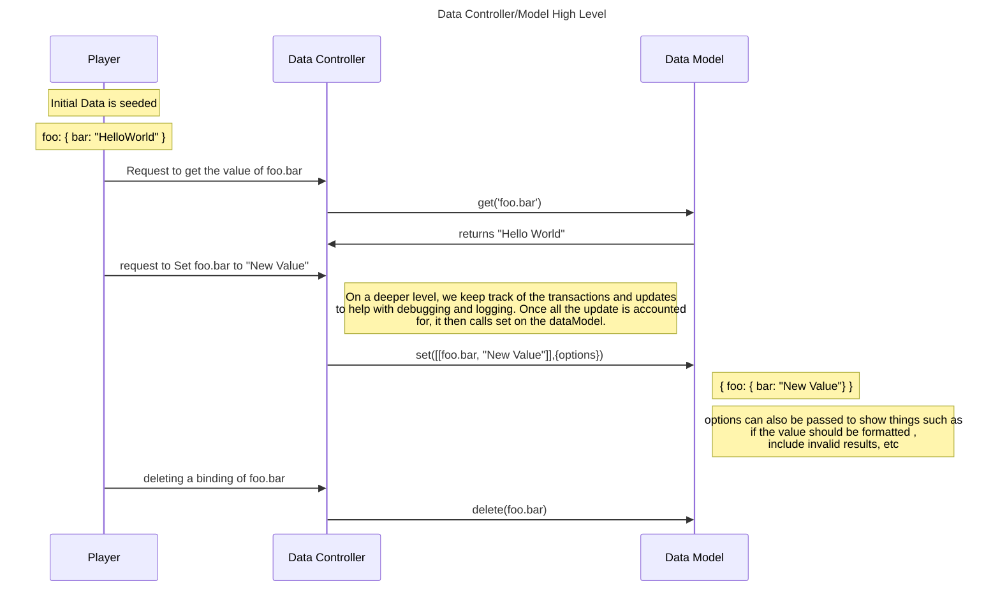

```mermaid
sequenceDiagram
    title Data Controller/Model High Level
    participant P as Player

    %% the controller is responsible for orchestrating the flow of data and handling interactions between the Data model
    participant DC as Data Controller

    %% the model is reponsible for defining the structure of the data, handling the data operations(get,set,delete), and managing middleware for data processing
    participant DM as Data Model
   
   
    Note over P: Initial Data is seeded
    Note over P: foo: { bar: "HelloWorld" }
    P->>DC: Request to get the value of foo.bar
    DC->>DM: get('foo.bar')
   
    DM->>DC: returns "Hello World"
    %%sets a binding of foo.bar to 'Hello World'

    
    P->>DC: request to Set foo.bar to "New Value"
    %% Set takes in a (transaction and options?) as its parameters
    
    
    Note right of DC: On a deeper level, we keep track of the transactions and updates <br> to help with debugging and logging. Once all the update is accounted <br> for, it then calls set on the dataModel.
    DC->>DM: set([[foo.bar, "New Value"]],{options})
    Note right of DM: { foo: { bar: "New Value"} }
    Note right of DM: options can also be passed to show things such as  <br> if the value should be formatted , <br>include invalid results, etc

    P->>DC: deleting a binding of foo.bar
    DC->>DM: delete(foo.bar)
    
```