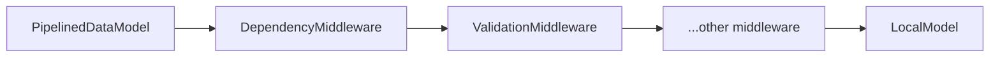

This page covers the low-level primitives in `core/player/src/data/` — plain in-memory storage, a middleware pipeline, and dependency tracking. It does **not** cover [DataController](/architecture/systems/data-controller) (`core/player/src/controllers/data/`), which is the higher-level orchestrator built *on top of* these primitives (formatting, default values, validation wiring, public `get`/`set`/`delete` API). This page is about what DataController composes, not the orchestrator itself.

## Key Files

- `core/player/src/data/model.ts` — `DataModelImpl`/`DataModelMiddleware` interfaces, `PipelinedDataModel`, `constructModelForPipeline`
- `core/player/src/data/local-model.ts` — `LocalModel`
- `core/player/src/data/noop-model.ts` — `NOOPDataModel`
- `core/player/src/data/dependency-tracker.ts` — `DependencyTracker`, `DependencyMiddleware`, `DependencyModel`

## LocalModel

*"A data model that stores data in an in-memory JS object"* (`core/player/src/data/local-model.ts:9`). It's the simplest possible `DataModelImpl` — `get`/`set`/`delete`/`reset` operating directly on a plain JS object, using `dlv` for reads and `timm`'s `setIn`/`omit`/`removeAt` for immutable writes. This is the base of the pipeline: the actual storage everything else sits in front of.

## The Middleware Chain

`DataModelMiddleware` (`core/player/src/data/model.ts:74`) is the generic shape any pipeline stage implements:

```ts
export interface DataModelMiddleware {
  /** The name of the middleware */
  name?: string;
  set(transaction: BatchSetTransaction, options?: DataModelOptions, next?: DataModelImpl): Updates;
  get(binding: BindingInstance, options?: DataModelOptions, next?: DataModelImpl): any;
  delete?(binding: BindingInstance, options?: DataModelOptions, next?: DataModelImpl): void;
  reset?(): void;
}
```

Each middleware receives the *next* model in the chain and decides whether/how to call it — the same shape used by `ValidationMiddleware` (which backs [ValidationController](/architecture/systems/validation-controller)) and by `DependencyMiddleware` below. `constructModelForPipeline` folds an ordered array of these into a single effective `DataModelImpl` by wrapping each middleware around the next with `toModel`.



## PipelinedDataModel

`PipelinedDataModel` (`core/player/src/data/model.ts:222`) — *"A DataModel that manages middleware data handlers"*. It holds a `DataPipeline` (an ordered array of `DataModelMiddleware | DataModelImpl`, terminating in something like `LocalModel`), builds the effective chained model via `constructModelForPipeline`, and exposes `setMiddleware`/`addMiddleware` to change the pipeline at runtime. It has one hook:

| Hook | Type | Fires when |
| --- | --- | --- |
| `hooks.onSet` | `SyncHook<[BatchSetTransaction]>` | After a `set()` transaction has been applied through the full pipeline |

## NOOPDataModel

`NOOPDataModel` (`core/player/src/data/noop-model.ts:7`) — *"A model that does nothing"*, used as a safe default (`NOOP_MODEL` singleton) when a pipeline is empty, and useful in tests.

## DependencyTracker / DependencyMiddleware / DependencyModel

`core/player/src/data/dependency-tracker.ts` defines a `DependencyTracker` base class that records every binding read (`readDeps`) and written (`writeDeps`) during an operation, with support for named sub-sets (`"core"` vs `"children"`) so a caller can distinguish "this node's own reads" from "reads made while resolving its children."

Two things build on it:

- **`DependencyMiddleware`** — a `DataModelMiddleware` that records dependencies as a pipeline stage while still forwarding to `next`.
- **`DependencyModel`** — a standalone `DataModelImpl` wrapper around a root model; every `get`/`set`/`delete` records a dependency and then delegates to the wrapped model.

**This tracker is not exclusive to `DataController`.** The single most important cross-subsystem fact here: the view [Resolver](/architecture/systems/view-parser-resolver) uses `DependencyModel` directly to implement incremental re-resolution. In `core/player/src/view/resolver/index.ts`, every node resolution wraps the data model in a fresh `DependencyModel` (`new DependencyModel(options.data.model)`), resolves the node's value against it, and stores the resulting read-dependency set alongside the node's previously-resolved value. On the next update, the Resolver compares the incoming changed-bindings set against each node's stored dependency set (`caresAboutDataChanges`) — if none of that node's tracked bindings changed, it reuses the cached resolved subtree instead of recomputing it. This is the mechanism behind the "incremental resolve" step described in [What Happens When Data Changes](/architecture/diagrams/data-change-flow).

## Relationship to Other Subsystems

- [DataController](/architecture/systems/data-controller) — composes `LocalModel` + a middleware pipeline into a `PipelinedDataModel`, and adds formatting/defaults/public API on top.
- [Resolver / Parser](/architecture/systems/view-parser-resolver) — uses `DependencyModel` per-node to decide whether to reuse a cached resolved subtree or recompute it.
- [ValidationController](/architecture/systems/validation-controller) — its `ValidationMiddleware` implements the same `DataModelMiddleware` interface described above and sits in the same pipeline.
