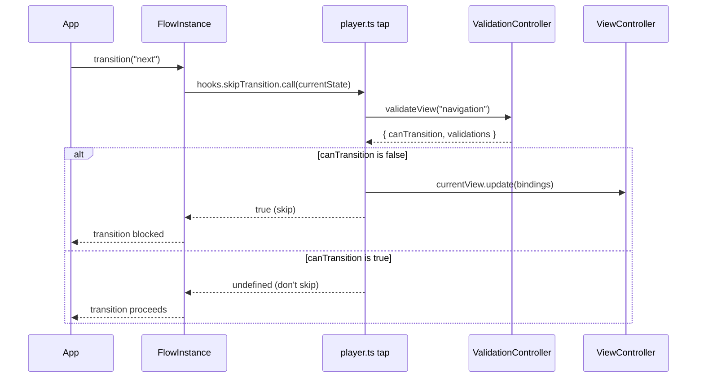

> **This is a runtime system, not the static content validator.** Everything on this page runs *during flow execution*, against live user data, inside a running Player instance. It is unrelated to the XLR/LSP-based validation covered in [Validating Player Content](/guides/validating-content) and [Custom LSP Validations](/guides/custom-lsp-validations), which check that *authored content* is semantically valid — at design time, typically inside an editor or CI, before any user ever sees the content. If you're trying to catch a malformed asset in your DSL/JSON, you want those guides. If you're trying to understand how a required-field error or a cross-field check blocks a "Next" button at runtime, you're in the right place.

`ValidationController` is *"a controller for orchestrating validation within a running player"* (`core/player/src/controllers/validation/controller.ts`, doc comment on lines 353-371, class declared at line 372). It tracks, per binding, which validations apply and what state they're in, gating both individual `set` calls and whole-view navigation.

## Why This Page Covers Three Classes

This page documents `ValidationController`, `ValidationMiddleware`, and `ValidationBindingTrackerViewPlugin` together because they have no independent identity outside the controller's orchestration. `ValidationController.getDataMiddleware()` directly constructs `new ValidationMiddleware(...)` internally and returns it as part of the data pipeline — it isn't something plugins instantiate or reuse on their own. Similarly, `ValidationBindingTrackerViewPlugin` is only ever constructed by `ValidationController.onView()`. Splitting these into separate pages would suggest an independence they don't have.

## Key Files

- `core/player/src/controllers/validation/controller.ts` — `ValidationController`, `ValidatedBinding`
- `core/player/src/validator/validation-middleware.ts` — `ValidationMiddleware`
- `core/player/src/validator/registry.ts` — `ValidatorRegistry`
- `core/player/src/controllers/validation/binding-tracker.ts` — `ValidationBindingTrackerViewPlugin`

## Construction

```ts
constructor(schema: SchemaController, options?: SimpleValidatorContext)
```

`ValidationController` is constructed once per `player.start(flow)` call, right after the `SchemaController` and before the `DataController` (whose middleware array includes `validationController.getDataMiddleware()`). See [Start to Render](/architecture/diagrams/start-to-render) for the full construction order.

## Validation Sources: Schema vs. Cross-Field

`ValidationController` pulls possible validations for a binding from two providers, registered via the `resolveValidationProviders` hook:

- **Schema-level** — [`SchemaController`](/architecture/systems/schema-controller) acting as a `ValidationProvider`, surfacing the `validation` array attached to a data type (`getValidationsForBinding`).
- **View / cross-field** — an internal `CrossfieldProvider` owned by the current `ViewInstance`, built from the view content's top-level `validation` array (x-field references, each optionally pointing at a binding via `ref`). These default to `trigger: "navigation"`, `severity: "error"`.

## Trigger Phases

Every validation reference has a `trigger`: `"load"`, `"change"`, or `"navigation"` (`Validation.Trigger` in `@player-ui/types`):

- **`load`** — runs once, the first time a binding is tracked (i.e., first appears on screen). This is also when `ValidationController` first gathers the full set of possible validations for that binding from both providers.
- **`change`** — runs any time the data changes, via `ValidationMiddleware` intercepting `DataController.set`.
- **`navigation`** — runs once when the user attempts to transition away from the view, via `FlowInstance`'s `skipTransition` hook.

Each binding's validations are tracked by an internal `ValidatedBinding`, which advances through these phases (`none` → `active` → possibly `dismissed`) and remembers which trigger it's currently evaluating.

## Warnings vs. Errors

Every validation has a `severity` of `"error"` or `"warning"`, and a `blocking` setting (`true` / `false` / `"once"`) that defaults to `true` for errors and `"once"` for warnings. In practice:

- **Warnings** can be dismissed by the user (each active warning gets a `dismiss()` callback), and by default only block navigation once — dismiss it, or navigate again, and it won't hold up the transition a second time.
- **Errors** have no dismiss mechanism. An active blocking error can only stop blocking navigation by being fixed (i.e., the underlying data changes so the validator no longer returns a response).

## `ValidationMiddleware`

`ValidationMiddleware` (`core/player/src/validator/validation-middleware.ts:37`) implements the [`DataModelMiddleware`](/architecture/systems/data-model) interface and sits in the `DataController`'s pipeline. On `set`, it stages incoming values in a `shadowModelPaths` map and runs the supplied `validator` function (constructed by `ValidationController` to call `updateValidationsForBinding(binding, "change", ...)`) against each staged binding before letting it continue down the pipeline. If a binding is invalid, its write is withheld from the next stage (so `LocalModel` never commits it) but still reported back as part of the `Updates` result with `force: true`, so the rest of Player (e.g. the view) knows to re-render with the invalid value visible. `get` calls made with `includeInvalid: true` read from the shadow model, which is how user-facing inputs see their own not-yet-valid input.

## `ValidatorRegistry`

`ValidatorRegistry` (`core/player/src/validator/registry.ts:4`) is a small named registry (`Map<string, ValidatorFunction>`) mapping a validation `type` string (e.g. `required`, `regex`) to its handler function. `ValidationController` builds one lazily via the `createValidatorRegistry` hook the first time a validator type is looked up.

## `ValidationBindingTrackerViewPlugin`

`ValidationBindingTrackerViewPlugin` (`core/player/src/controllers/validation/binding-tracker.ts`) is a `ViewPlugin` that `ValidationController.onView()` attaches to every new `ViewInstance`. Via `view.hooks.resolver`, it taps several hooks on the view's `Resolver` (`beforeUpdate`, `skipResolve`, `resolveOptions`, `afterNodeUpdate`) to discover, as the AST resolves, which bindings assets actually call `validation.get`/`getValidationsForBinding` on — those are the bindings that get tracked (`onTrackBinding`) and are what `getBindings()`/`validateView()` iterate over.

## Blocking a Transition

A single `transition()` call on a `FlowInstance` runs its `skipTransition` bail hook before doing anything else. Player taps that hook once at startup to ask the `ValidationController` whether the current view's validations allow navigation:



If `canTransition` is `false`, Player pushes the affected bindings into `viewController.currentView.update(...)` so the view re-renders with the now-visible validation messages, and returns `true` from the hook — which, being a `SyncBailHook`, short-circuits `transition()` before it ever looks at `beforeTransition`/`resolveTransitionNode`.

## Hooks / Extension Points

| Hook | Type | Gives you | Use it when… |
| --- | --- | --- | --- |
| `createValidatorRegistry` | `SyncHook<[ValidatorRegistry]>` | The registry, right before its first use | You want to register custom validator types (e.g. a `custom-required` handler) |
| `onAddValidation` | `SyncWaterfallHook<[ValidationResponse, BindingInstance]>` | Per its doc comment, meant to fire "when a new validation is added to the view" — but as of this writing it's declared and never `.call()`ed anywhere in `core/player` | Not currently actionable; treat as reserved |
| `onRemoveValidation` | `SyncWaterfallHook<[ValidationResponse, BindingInstance]>` | Documented as the inverse of `onAddValidation`, with the same caveat — declared but not called in `core/player` today | Not currently actionable; treat as reserved |
| `resolveValidationProviders` | `SyncWaterfallHook<[Array<{ source: string; provider: ValidationProvider }>]>` | The list of `{ source, provider }` pairs (schema + view, by default) | You want to add a third validation source |
| `onTrackBinding` | `SyncHook<[BindingInstance]>` | The binding, the moment it starts being tracked | You want to know when a new field enters the validation system |

## Relationship to Other Subsystems

- [DataController](/architecture/systems/data-controller) — hosts `ValidationMiddleware` in its pipeline via `getDataMiddleware()`
- [SchemaController](/architecture/systems/schema-controller) — the schema-level `ValidationProvider`
- [Data Model](/architecture/systems/data-model) — defines the `DataModelMiddleware` interface `ValidationMiddleware` implements
- [A2UI](/plugins/multiplatform/a2ui) — its checks-to-schema adapter synthesizes `validation` references that run through this same `ValidationController`, using a `"change"` trigger
- [Validating Player Content](/guides/validating-content) / [Custom LSP Validations](/guides/custom-lsp-validations) — the design-time counterpart; see the disambiguation note above
