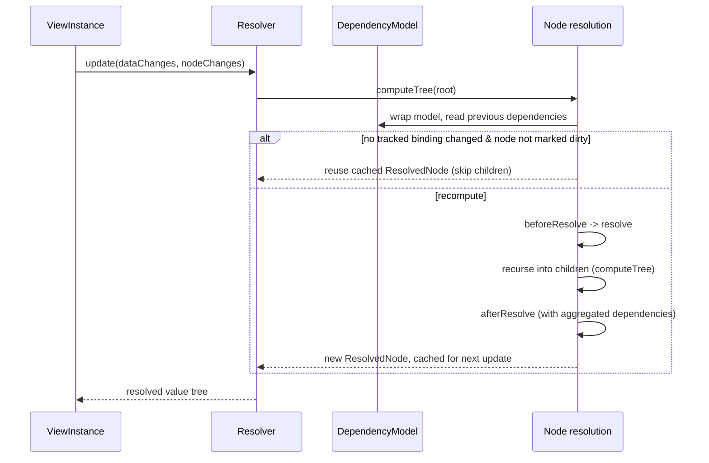

The `Parser` is *"the way to take an incoming view from the user and parse it into an AST. It provides a few ways to interact with the parsing, including mutating an object before and after creation of an AST node"* (`core/player/src/view/parser/index.ts:75`). The `Resolver` is *"the way to take a parsed AST graph of a view and resolve it to a concrete representation of the current user state. It combines the ability to mutate ast nodes before resolving, as well as the mutating the resolved objects while parsing"* (`core/player/src/view/resolver/index.ts:97`). Together they're the engine behind every view: JSON in, a data-bound render tree out, kept in sync as the user interacts with the flow.

## Key Files

- `core/player/src/view/parser/index.ts` — the `Parser` class
- `core/player/src/view/parser/types.ts` — the `Node` namespace (`Node.Asset`, `Node.Value`, `Node.MultiNode`, `Node.Switch`, `Node.Applicability`, `Node.Template`, `Node.Async`, `Node.Empty`, `Node.Unknown`) and `NodeType` enum
- `core/player/src/view/resolver/index.ts` — the `Resolver` class
- `core/player/src/view/resolver/types.ts` — the `Resolve` namespace (`ResolverOptions`, `NodeResolveOptions`, `ResolvedNode`, `Plugin`) and `ResolverStage` enum
- `core/player/src/view/resolver/ResolverError.ts` — `ResolverError`
- `core/player/src/view/resolver/utils.ts` — `caresAboutDataChanges`, `toNodeResolveOptions`
- `core/player/src/view/builder/index.ts` — the `Builder` class

A `Parser` and `Resolver` pair is created once per `ViewInstance`, the first time it's updated — see [ViewController & ViewInstance](/architecture/systems/view-controller) and [Start to Render](/architecture/diagrams/start-to-render) for how that fits into `player.start()`.

## From JSON to AST: the Parser

`Parser.parseView(value)` is the entry point, calling `parseObject` on the raw view content with `NodeType.View`. `parseObject` recursively walks the object: for every nested object/array it fans out into `NodeType.Value`/`Asset`/`View` children, building a tree of `Node.Node`s (each a plain object tagged with a `type`, an optional `parent` back-reference, and either a `value` + `children` or a type-specific shape like `Node.MultiNode`'s `values` array).

The parser itself doesn't know about assets, switches, templates, or multi-nodes — those are all injected by [the core view plugins](/architecture/systems/view-plugins) tapping the parser's hooks. `parser.hooks.parseNode` is a `SyncBailHook`, so the first plugin tap that returns a node (or an empty array to prune) wins and stops the chain; `onParseObject`/`onCreateASTNode` are waterfall hooks that let every plugin see and adjust the object/node in sequence.

## From AST to Resolved Tree: the Resolver

`Resolver.update(dataChanges?, nodeChanges?)` walks the AST from `root` via a private `computeTree(node, ...)` recursion and returns the fully resolved value (a plain object tree ready for the renderer). For every node, `computeTree`:

1. Wraps the current data model in a fresh `DependencyModel` (see [The Data Model Primitives](/architecture/systems/data-model)) so every `get`/`set` made while resolving *this node* is recorded.
2. Looks up the node's previously resolved value and its previously-tracked dependency set (`getPreviousResult`).
3. Decides whether it can reuse that cached value: `caresAboutDataChanges` checks whether any binding in `dataChanges` overlaps the node's tracked dependencies, `nodeChanges` checks whether the node itself was explicitly marked dirty (via `ViewController.updateViewAST`), and the `skipResolve` hook gets the final say.
4. If reusing, it repopulates the internal `ASTMap` (a map from resolved node back to its source AST node, used by plugins like `AssetTransformCorePlugin` to look up the pre-resolve node) from the prior update's map, and returns the cached `ResolvedNode` unchanged — children are never re-visited.
5. Otherwise it clones the node, runs it through `beforeResolve` → `resolve`, recurses into children/`MultiNode` values (accumulating their dependencies), then runs `afterResolve` with the aggregated dependency set attached via `getDependencies`.

The resolved value, the (possibly new) dependency set, and an `updated` flag are cached for the next `update()` call, and `resolveCache`/`idCache` are swapped in wholesale at the end of the call so a node that disappears from the tree doesn't leak stale cache entries. Duplicate `id`s on `Asset`/`View`/`Value` nodes are detected and logged (via `getNodeID`/`idCache`) since they'd otherwise cause two unrelated nodes to share a cache entry.

Errors thrown from any hook tap are caught and re-thrown as a `ResolverError`, tagged with the `ResolverStage` (`resolveOptions`, `skipResolve`, `beforeResolve`, `resolve`, `afterResolve`, `afterNodeUpdate`) it occurred in and the node it occurred on — this is what shows up as `error.metadata.node` when a plugin's transform throws.

### Sequence: a single `Resolver.update()` call

## Builder

`Builder` (`core/player/src/view/builder/index.ts:7`) is a set of static helpers — *"Functions for building AST nodes (relatively) easily"* — for hand-constructing `Node.Asset`/`Node.Value`/`Node.MultiNode`/`Node.Async` nodes and wiring up `parent`/`children` references without repeating the AST's plumbing. It's mainly useful to plugin and test authors who need to synthesize AST nodes directly (for example, a plugin that injects a new node in a `beforeResolve` tap).

## Hooks / Extension Points

### Parser (`parser.hooks`)

| Hook | Type | Fires when |
| --- | --- | --- |
| `parseNode` | `SyncBailHook<[obj, nodeType, parseOptions, childOptions?], Node.Node \| Node.Child[]>` | For every object about to be parsed; the first tap to return a value (or `null`/`[]` to prune) wins |
| `onParseObject` | `SyncWaterfallHook<[object, NodeType]>` | Before parsing an object's own properties, lets a plugin rewrite it first |
| `onCreateASTNode` | `SyncWaterfallHook<[Node.Node \| undefined \| null, object]>` | After an AST node is built from an object, lets plugins replace or discard (`null`) it |

### Resolver (`resolver.hooks`)

| Hook | Type | Fires when |
| --- | --- | --- |
| `resolveOptions` | `SyncWaterfallHook<[NodeResolveOptions, Node.Node]>` | Building the per-node options (data model, `evaluate`, etc.) before anything else runs |
| `skipResolve` | `SyncWaterfallHook<[boolean, Node.Node, NodeResolveOptions]>` | Deciding whether to reuse the node's cached value instead of recomputing it |
| `beforeResolve` | `SyncWaterfallHook<[Node.Node \| null, NodeResolveOptions]>` | Transforming the AST node itself before it's turned into a value (returning `null` removes the node) |
| `resolve` | `SyncWaterfallHook<[any, Node.Node, NodeResolveOptions]>` | Turning the (possibly transformed) AST node into its resolved value, before children are resolved |
| `afterResolve` | `SyncWaterfallHook<[any, Node.Node, NodeResolveOptions]>` | Transforming the resolved value after all children have been resolved and merged in |
| `beforeUpdate` | `SyncHook<[Set<BindingInstance> \| undefined]>` | Once, at the start of `update()`, before any node is visited |
| `afterUpdate` | `SyncHook<[any]>` | Once, at the end of `update()`, with the final resolved value |
| `afterNodeUpdate` | `SyncHook<[Node.Node, Node.Node \| undefined, ResolvedNode & { updated: boolean }]>` | After each individual node finishes resolving (or is reused from cache) |

## Relationship to Other Subsystems

- [The Core View Plugins](/architecture/systems/view-plugins) — the seven built-in plugins that tap these exact Parser/Resolver hooks, applied in a fixed order, to implement assets, switches, applicability, transforms, string resolution, templates, and multi-nodes.
- [The Data Model Primitives](/architecture/systems/data-model) — the `DependencyModel` the Resolver wraps around the data model on every node visit to decide whether a cached value can be reused.
- [ViewController & ViewInstance](/architecture/systems/view-controller) — constructs the `Parser`/`Resolver` pair for each view and drives `update()` in response to data changes and navigation.
- [AsyncNode Plugin](/plugins/multiplatform/async-node) — `AsyncNodePluginPlugin` (from `@player-ui/async-node-plugin`) plugs directly into this Parser/Resolver hook surface to stream new AST content into an already-resolved tree.
