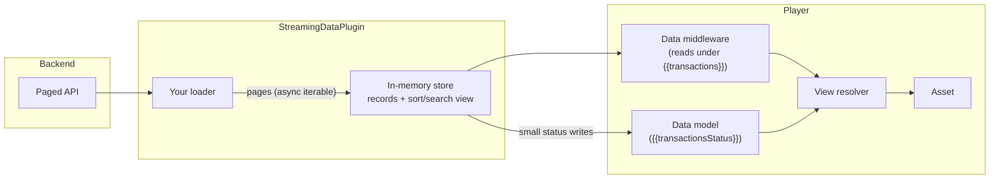

import { Aside } from "@astrojs/starlight/components";
import CoreOnly from "../../../../components/CoreOnly.astro";

<CoreOnly />

This plugin loads large, paginated data sets (tested with 50k records and ~200MB payloads) into Player without writing them to the data model. Records are fetched page by page through a loader extended from the provided base, held in the plugin's own memory, and served to content through a data-model middleware at a configured binding. Assets reference the data like any other binding, and pagination progress is published to a status binding so content can render loading indicators.

Use it when a backend can't answer queries over a large data set and the UI needs the whole thing client-side, for example a table over tens of thousands of rows.

## How it works

The mental model: **Player's data model stays the interface, but stops being the storage.**

Normally every binding read and write lands in Player's in-memory model (the `LocalModel`). Copying a 200MB payload into it would mean large deep-equality checks on writes, the whole blob showing up in `serialize()`, and any content author being able to mutate the records. Instead, this plugin registers a [DataController](/architecture/systems/data-controller) middleware that intercepts reads under one binding prefix and answers them from its own store:



Three things happen per loaded page:

1. The records are appended to the plugin's store (held once, never copied into the model)
2. A small status object (`loadedPages`, `totalPages`, `completed`, ...) is written to the status binding through the normal data pipeline
3. The plugin tells Player the data binding changed, so any view that read it re-resolves and pulls the new records through the middleware

Because reads flow through the normal `DataController.get` path, everything downstream of it just works: bindings in content (`{{transactions.5.amount}}`), expressions, dependency tracking, and view updates. Content cannot tell the data isn't really in the model, with three intentional exceptions:

- The streamed binding is **read-only**. Writes and deletes against it are ignored with a warning, so the shared in-memory copy can't be corrupted
- `serialize()` output **excludes** the streamed records (the status binding is still included)
- Reading an **ancestor** of the streamed binding (like the model root) won't include the streamed subtree

## Implementing a loader

The loader is the contract between the plugin and your backend. For index-based pagination extend `PagedStreamingDataLoader` and implement one method:

```ts
import { PagedStreamingDataLoader } from "@player-ui/streaming-data-plugin";

interface Transaction {
  id: string;
  amount: string;
  description: string;
}

class TransactionLoader extends PagedStreamingDataLoader<Transaction> {
  protected async fetchPage(pageIndex: number, signal: AbortSignal) {
    const response = await fetch(`/transactions?page=${pageIndex}`, { signal });
    const { records, totalPages } = await response.json();

    return { records, totalPages };
  }
}
```

Pages are requested sequentially starting at index 0. After each page the plugin decides whether to keep going, in this order:

1. `hasMore` on the result, when returned
2. otherwise `pageIndex + 1 < totalPages`, when `totalPages` is known
3. otherwise it keeps fetching until a page comes back empty

For anything fancier (cursor pagination, retries with backoff, prefetching several pages in parallel and yielding them in order), extend `StreamingDataLoader` directly. It is a single async iterable, so the loader stays in full control of its fetch strategy:

```ts
import {
  StreamingDataLoader,
  StreamingDataLoadContext,
  StreamingDataPage,
} from "@player-ui/streaming-data-plugin";

class CursorLoader extends StreamingDataLoader<Transaction> {
  async *load(
    context: StreamingDataLoadContext,
  ): AsyncIterable<StreamingDataPage<Transaction>> {
    let cursor: string | undefined;

    do {
      const page = await this.fetchAfter(cursor, context.signal);
      cursor = page.nextCursor;
      yield { records: page.records };
    } while (cursor && !context.signal.aborted);
  }
}
```

Loader rules of the road:

- **Honor the `AbortSignal`.** It fires when the flow ends or a new flow starts. Pass it to `fetch` so in-flight requests actually cancel
- **Report `totalPages` as soon as you know it** (it can be included on any page, and revised). Without it content can't render "page 3 of 100" style progress
- **Throwing is safe.** The error message lands on the status binding's `error` field, already-loaded pages remain available, and the flow keeps running. Retry policies belong inside the loader
- **Yield in display order.** Pages are appended in the order they're yielded

## Registering the plugin

```js
import { Player } from "@player-ui/player";
import { StreamingDataPlugin } from "@player-ui/streaming-data-plugin";

const player = new Player({
  plugins: [
    new StreamingDataPlugin({
      binding: "transactions",
      loader: new TransactionLoader(),
    }),
  ],
});
```

The same instance works with React Player, since core plugins are applied directly:

```js
const reactPlayer = new ReactPlayer({
  plugins: [streamingDataPlugin],
});
```

One plugin instance can manage several independent sources:

```js
new StreamingDataPlugin([
  { binding: "transactions", loader: new TransactionLoader() },
  { binding: "accounts", loader: new AccountLoader(), lazy: true },
]);
```

Per-source options:

| Option            | Default                     | Description                                           |
| ----------------- | --------------------------- | ----------------------------------------------------- |
| `binding`         | required                    | Where the records are exposed in the data model       |
| `loader`          | required                    | The `StreamingDataLoader` implementation              |
| `statusBinding`   | `<binding>Status`           | Where pagination status is written                    |
| `lazy`            | `false`                     | Defer loading until the data binding is first read    |
| `freeze`          | `true`                      | Freeze records and handed-out arrays against mutation |
| `searchPredicate` | substring match             | Custom search matcher factory                         |
| `comparator`      | numeric-aware field compare | Custom sort comparator factory                        |

Bindings (including status bindings) must not overlap one another; the constructor throws if they do.

## Referencing streamed data in content

Records and status resolve like any other data:

```json
{
  "asset": {
    "id": "transactions-table",
    "type": "table",
    "rows": "{{transactions}}",
    "metaData": {
      "loading": "{{transactionsStatus.loading}}",
      "progress": "{{transactionsStatus.loadedPages}} of {{transactionsStatus.totalPages}}"
    }
  }
}
```

A value that is exactly one binding ref (`"{{transactions}}"`) resolves to the raw array, so an asset can receive all records without stringification. Sub-paths (`{{transactions.0.id}}`) and `{{transactions.length}}` also work.

The status binding carries:

| Field          | Type    | Description                                      |
| -------------- | ------- | ------------------------------------------------ |
| `started`      | boolean | The loader has been asked to start               |
| `loading`      | boolean | Pages are actively being fetched                 |
| `completed`    | boolean | Every page has loaded                            |
| `loadedPages`  | number  | Pages loaded so far                              |
| `totalPages`   | number? | Total pages expected, once the loader reports it |
| `totalRecords` | number  | Records loaded so far                            |
| `error`        | string? | The failure message if the loader threw          |

## Sorting and searching

The data stays queryable through normal Player mechanisms. The plugin registers expressions that operate on the in-memory store and re-resolve any views reading the binding:

```js
// Sort by a field ("asc" is the default direction). Omit the field to clear the sort.
sortStreamingData("transactions", "amount", "desc");

// Case-insensitive substring search across record fields. Omit the query to clear it.
searchStreamingData("transactions", "brokerage");

// Clear both
clearStreamingDataQuery("transactions");
```

These are regular expressions, so they can hang off an `action` asset's `exp`, run on view transitions, or be evaluated programmatically. Search and sort compose (search filters first, then sort orders the matches), and `{{transactions.length}}` reflects the filtered count while `{{transactionsStatus.totalRecords}}` keeps the unfiltered total.

The defaults compare a single field with numeric awareness (numeric strings like `"1467.65"` sort as numbers, missing values sort last) and search across a record's own string, number, and boolean properties. Supply `comparator` / `searchPredicate` on the source config for anything else, like locale-sensitive collation or searching only specific columns.

The same operations are available on the plugin instance as `plugin.sort()`, `plugin.search()`, and `plugin.clearQuery()` for custom asset code that holds a plugin reference.

## Building an asset for streamed data

This is where teams usually trip. The plugin makes 50k records cheap to _resolve_; the asset has to keep them cheap to _render_.

- **Virtualize the rendering.** Receive the full array (`rows: "{{transactions}}"`) and window it in the component (react-window, TanStack Virtual, or similar). Rendering 50k DOM rows will hang the page no matter how fast Player is
- **Never iterate the streamed binding with a content `template`.** Templates expand one AST node per row at resolve time. At 50k rows that is 50k assets in the view tree, which defeats the entire design
- **Treat the records as immutable.** They're frozen by default, and every consumer shares the same objects. Copy before local transforms (`rows.slice().reverse()`), or better, use the sort/search expressions so all consumers see the same view
- **Use the array identity as your re-render signal.** Every page append or query change hands out a **new** array reference, and anything in between returns the same cached reference. A `React.memo` / `useMemo` keyed on the array reference is enough to know when to recompute derived state
- **Drive skeletons and progress from the status binding.** `loading` and `loadedPages` / `totalPages` update as pages land, and `completed` distinguishes "empty result" from "still loading". Handle `error` too: already-loaded rows remain available, so a table can show partial data with an error banner
- **Expect the row count to grow while `loading` is true.** A table that scrolls-to-bottom or paginates internally should anchor on the user's position, not the array length

## Lifecycle

- Loading starts when the flow starts (right after Player's data controller is created), or on first read of the data binding with `lazy: true`
- Before any data loads, the data binding resolves to an empty array, so content doesn't need null guards
- When the flow ends or a new flow starts, the loader's `AbortSignal` fires and the store is dropped, releasing the memory. Starting another flow with the same plugin instance loads fresh data
- Query state (sort/search) lives with the flow, so a restarted flow begins unfiltered

## Limitations

- The streamed binding is read-only by design. Row editing needs a different pattern (for example writing edits to a normal binding keyed by record id, and merging in the asset)
- Streamed records don't participate in `serialize()`, validation, or schema defaults. They're display data, not form data
- Reading the model root (or any ancestor of the streamed binding) won't include the streamed subtree
- Loaders are per-source and sequentially consumed; if you need parallel fetching, do it inside `load()` and yield in order

## Performance

Measured with 50k records (~500 byte JSON rows, ~28MB payload) streaming through a live Player with a view bound to the data, on an M-series laptop:

| Operation                                        | Time     |
| ------------------------------------------------ | -------- |
| Full ingest, 100 pages, view updating throughout | ~130ms   |
| 1000 random `{{transactions.N.field}}` reads     | ~3ms     |
| Search across all fields                         | ~20ms    |
| Sort on a numeric string field                   | ~30-85ms |
| `serialize()` with the blob loaded               | ~0.3ms   |

The package's `performance.test.ts` re-validates these bounds in CI, and `index.bench.ts` tracks them against a benchmark baseline. Point the `STREAMING_DATA_FIXTURE` env var at a JSON array file to run the performance suite against a real payload locally.
