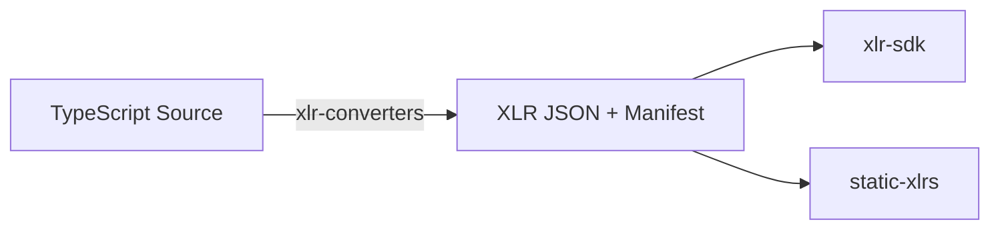

XLR lives in its own repo (`player-ui/xlr`) and ships as a handful of small, single-purpose packages rather than one monolithic library. This page covers how those packages fit together, why they're split the way they are, and what's supported today across languages.

## Overview



TypeScript source is compiled once, at build time, into XLR JSON plus a manifest. From that point on, nothing downstream needs a TypeScript compiler. The SDK loads and validates against plain JSON, and pre-compiled bundles (`static-xlrs`) can be checked straight into a repo or shipped in a package.

## Packages

| Package | Role |
|---|---|
| `@xlr-lib/xlr` | Pure AST type definitions (`core.ts`, `utility.ts`): `NodeType`, `Annotations`, `Manifest`, etc. No runtime logic. |
| `@xlr-lib/xlr-converters` | `TsConverter`: TypeScript → XLR, built on the TS compiler API. `TSWriter`/`exportTypesToTypeScript`: XLR → TypeScript `.d.ts` (the reverse direction). Ships the `xlr` CLI bin used by `player xlr compile`. |
| `@xlr-lib/xlr-sdk` | `XLRSDK`: load, validate, and export XLRs at runtime. Deliberately has no dependency on the `typescript` package. |
| `@xlr-lib/xlr-utils` | TS-compiler-independent tree algorithms shared by `xlr-sdk` and `xlr-converters`: `fillInGenerics`, `computeExtends`, `resolveReferenceNode`, `resolveConditional`, `computeEffectiveObject`, the `Pick`/`Omit`/`Partial`/`Required`/`Exclude` mapped-type appliers, and type guards. |
| `@xlr-lib/static-xlrs` | Pre-compiled JSON XLRs for Player's own core types (`Asset`, `View`, `Flow`, `Navigation*`, `Schema.*`, `Validation.*`) and the reference-assets plugin. |

## Design note: why xlr-sdk has no TypeScript-compiler dependency

:::note
TypeScript-compiler-API-dependent code used to live in `xlr-utils`, but it was deliberately moved into `xlr-converters` instead. That way `xlr-sdk`, and anything built on it like the Player LSP or a browser-based content editor, never has to pull in the multi-megabyte `typescript` package at runtime. `xlr-sdk` only ever touches pre-compiled JSON; it never needs to parse or type-check TypeScript source itself.
:::

## Extension Points

There are four ways to extend or plug into XLR:

1. **Plugin-side**: implement `ExtendedPlayerPlugin<Assets, Views, Expressions, DataTypes, Formatters, Validators>` on your Player plugin so the CLI's static analysis knows which exported types to compile. See [Exporting Plugin Capabilities](../../usage/export#exporting-plugin-capabilities).
2. **Custom `XLRRegistry`**: pass your own registry implementation to `new XLRSDK(customRegistry)` if the default in-memory store doesn't fit your use case. See [Real-World Consumers](../consumers) for how the Player LSP does exactly this.
3. **Transform Functions**: rewrite XLR nodes as they're loaded. See [Transform Functions](../../concepts#transform-functions).
4. **Filters**: exclude plugins/capabilities/types when loading or listing. See [Filters](../../concepts#filters).

## Language Support

What XLR can be generated *from* and what it can be loaded/consumed *into* are asymmetric and easy to conflate, so here's the current state plainly:

| Direction | Language | Status |
|---|---|---|
| Generate FROM | TypeScript | Supported. `xlr-converters`'s `TsConverter`, built on the TS compiler API. No other source language is supported today. |
| Load/consume INTO | TypeScript | Supported: `@xlr-lib/xlr-sdk`. |
| Load/consume INTO | Python | In development. Node classes, type guards, and a JSON deserializer exist, but there's no packaging manifest yet, so it isn't installable as a published package today. |
| Load/consume INTO | Kotlin | In progress. A deserializer, serializer, type guards, and Maven-publish scaffolding exist, but this hasn't been merged into the main XLR codebase yet. |

Generation is a single funnel: TypeScript in, always, while consumption fans out to multiple languages. That fan-out is the entire point of XLR being "language agnostic": compile once, read from anywhere.

## Manifest format on disk

A compiled XLR bundle is a directory of JSON files:

```
<package>/
  xlr/
    manifest.json     # static form: capability name -> list of type names
    manifest.js        # dynamic form: capability name -> list of NamedType objects
    Asset.json         # one file per Named Type
    ActionAsset.json
    ...
```

See [Capability](../../concepts#capability) for the exact `Manifest` vs. `TSManifest` shapes those two manifest files correspond to.
